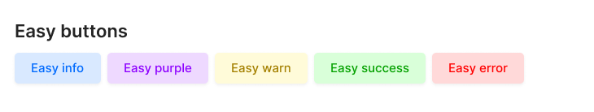

# react-easy-button

Implement easily customize out of the box. Work with a vast number of pre-maid react button themes



## Installation

```bash
# NPM
npm i react-easy-button

# Yarn
yarn add react-easy-button

# Pnpm 
pnpm add react-easy-button
```

## Simple example

```ts
import React from 'react'
import {EasyButton} from 'react-easy-button';

const Button: React.FC = () => {
    return (
	<EasyButton label="Press me" />
    )
}
```

## Custom style

**Style**

**Note**: If theme is not equal to `custom` it will not work

If the style is provided through style prop it will reset previous styles & apply provided style. In this example below button will only have color & background color style. The rest of the styles will be reset. To avoid this use `extendStyle` prop.

```ts
<EasyButton label="Press me" style={{color: "#242424", backgroundColor: "#fcfcfc"}} />
```

**Extend styles**

It will keep all previous styles & only change provided styles. It will work for all themes

```ts
<EasyButton label="Press me" extendStyle={{color: "#242424", backgroundColor: "#fcfcfc"}} />
```

## EasyButton props

| Attributes       | Type         | Default value | Description                                                                                                                                                                                                     |
| ---------------- | ------------ | ------------- | --------------------------------------------------------------------------------------------------------------------------------------------------------------------------------------------------------------- |
| label            | `string`   | `undefined` | `Required`. If not provided, will throw error.                                                                                                                                                                |
| title            | `string`   | `undefined` | `Optional`. Title attribute of html button tag.                                                                                                                                                               |
| theme            | `string`   | `primary`   | `Optional`. Available themes (custom, error, success, warn, purple, pink, primary)                                                                                                                           |
| debounceTimeout  | `number`   | `0`         | `Optional`. Delaytime in ms (eg. 100 = 100ms))                                                                                                                                                                |
| disabled         | `boolean`  | `false`     | `Optional`.                                                                                                                                                                                                  |
| style            | `object`   | `undefined` | `Optional`. If provided & `theme === "custom"` then only provided style will be applyed                                                                                                                    |
| extendStyle      | `object`   | `undefined` | `Optional`. If provided, will change only provided styles. eg. `theme="purple"` & extendStyle={{border: "2px solid purple"}} it will keep theme styles with provided style `border: "2px solid purple"`"" |
| hoverStyle       | `object`   | `undefined` | `Optional`. If mouse entered then provided style will applied                                                                                                                                                 |
| extendHoverStyle | `object`   | `undefined` | `Optional`. Provided styles will be applied if mouse entered.                                                                                                                                                 |
| easyRef          | `object`   | `undefined` | `Optional`. Will return referance of the button                                                                                                                                                               |
| onClick          | `function` | `undefined` | `Optional`. Will run the function if button is clicked                                                                                                                                                        |
| onHover          | `function` | `undefined` | `Optional`. Will run the function if mouse cursor hovered on the button                                                                                                                                       |
| onFocus          | `function` | `undefined` | `Optional`. Will run the function if button is focused                                                                                                                                                        |
|                  |              |               |                                                                                                                                                                                                                 |

## License

MIT
